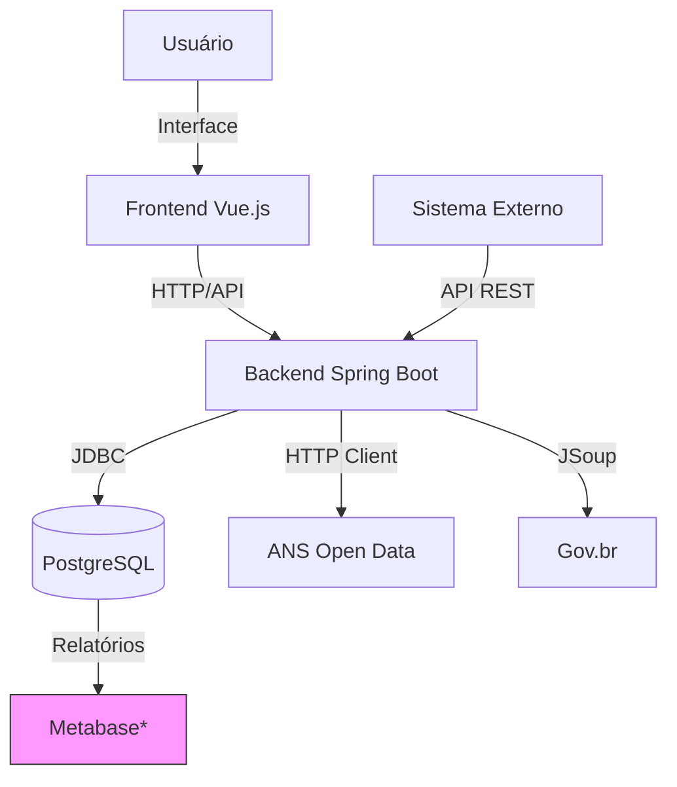
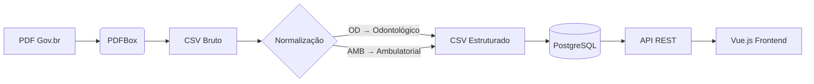

# **ANS Data Processing System**

**Desenvolvedor:** [Rômulo Régis Gurgel](https://github.com/romulogurgeldev)  
**Email:** [rgurgel.romulo@gmail.com](mailto:rgurgel.romulo@gmail.com)  
**Última Atualização:** `{{31-03-2025}}`

---

## **📌 Visão Geral**
Sistema completo para processamento de dados da **ANS (Agência Nacional de Saúde Suplementar)** com arquitetura moderna, incluindo:

✅ **Web scraping** automatizado de documentos PDF  
✅ **Pipeline ETL** (PDF → CSV → Banco de Dados)  
✅ **API REST** documentada com SpringDoc OpenAPI  
✅ **Interface web** Vue.js 3 com Composition API  
✅ **Infraestrutura como código** (Docker Compose)

---

## **📐 Arquitetura do Sistema**



> *Opcional: Ferramenta de BI para análises avançadas

---

## **🚀 Como Executar**

### **Pré-requisitos**
- Docker 20.10+ e Docker Compose 1.29+
- 4GB de RAM disponível

```bash
git clone https://github.com/romulogurgeldev/ans-data-processing.git
cd ans-data-processing
docker-compose up -d --build
```

---

## **🔍 Acessos**

| Serviço               | URL/Local                   | Credenciais               |
|-----------------------|----------------------------|--------------------------|
| Frontend (Vue.js)     | http://localhost:8081      | -                        |
| Backend (Spring Boot) | http://localhost:8080      | -                        |
| API Docs (Swagger)    | http://localhost:8080/swagger-ui.html | - |
| PostgreSQL           | localhost:5432             | postgres/password        |
| Actuator (Health)    | http://localhost:8080/actuator/health | - |

---

## **🛠 Stack Tecnológica**

| Camada           | Tecnologias                                                                 |  
|------------------|-----------------------------------------------------------------------------|  
| **Frontend**     | Vue 3, Pinia, Axios, TailwindCSS                                           |  
| **Backend**      | Spring Boot 3, JPA/Hibernate, JSoup, PDFBox, SpringDoc (OpenAPI)           |  
| **Banco**        | PostgreSQL 13, Flyway (migrações), QueryDSL (consultas complexas)          |  
| **Infra**        | Docker, Docker Compose, Nginx, Prometheus (monitoramento)                  |  

---

## **⚙️ Fluxo de Dados**



---

## **🔧 Decisões Arquiteturais**

1. **Containerização**:
   - Isolamento completo de serviços
   - Portas: `8080` (Backend), `8081` (Frontend), `5432` (PostgreSQL)

2. **Resiliência**:
   - Retry automático para chamadas HTTP
   - Circuit Breaker para APIs externas

3. **Segurança**:
   - CORS configurado por ambiente
   - HTTPS obrigatório em produção

4. **Monitoramento**:
   - Endpoints Actuator (`/actuator`)
   - Métricas no formato Prometheus

---

## **📈 Próximas Evoluções**

- [ ] Integração com Apache Kafka
- [ ] Implementação de cache com Redis
- [ ] Dashboard de métricas com Grafana
- [ ] Autenticação JWT para API

---

## **📂 Estrutura do Projeto**

```
ans-data-processing/
├── backend/                  # Spring Boot 3 (Java 17)
│   ├── src/
│   │   ├── main/
│   │   │   ├── java/         # Código fonte
│   │   │   └── resources/    # Configurações
│   │   └── test/             # Testes
│   └── pom.xml               # Dependências
│
├── frontend/                 # Vue 3 + Babel
│   ├── public/               # Arquivos estáticos
│   ├── src/                  # Código Vue
│   ├── babel.config.js       # Configuração do Babel  ← ATUALIZADO
│   └── package.json          # Dependências Node
│
├── database/                 # Scripts SQL
│   ├── create_tables.sql     # DDL completo
│   └── queries.sql           # Consultas analíticas
│
├── documentation/
│   ├── ARCHITECTURE.md       # Documentação técnica
│   └── api_postman.json      # Coleção Postman
│
├── scripts/
│   ├── setup_db.sh           # Configura banco
│   └── import_data.sh        # Importa dados
│
├── docker-compose.yml        # Config Docker
├── Dockerfile.backend        # Build backend
└── Dockerfile.frontend       # Build frontend
```

---

## **⚡ Comandos Úteis**

```bash
# Rebuildar um serviço específico
docker-compose up -d --no-deps --build backend

# Ver logs em tempo real
docker-compose logs -f backend

# Acessar banco via CLI
docker-compose exec postgres psql -U postgres ans_db
```

---

## **📄 Licença**
MIT License - Veja [LICENSE](LICENSE) para detalhes.

---

**✉️ Contato:**  
[GitHub](https://github.com/romulogurgeldev) | [Email](mailto:rgurgel.romulo@gmail.com) | [LinkedIn](https://www.linkedin.com/in/r%C3%B4mulo-r%C3%A9gis-gurgel-596b7b218/)

--- 

**🔹 Dica:** Para desenvolvimento local sem Docker, use:
```bash
cd backend && ./mvnw spring-boot:run
cd frontend && npm run dev
```